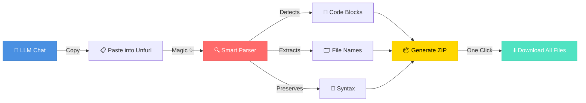

# 🗂️ Unfurl - Your AI Chat File Extractor

<div align="center">


[](https://icraftnow.github.io/MarkDown-File-Extractor/)
[](https://github.com/iCraftNow/MarkDown-File-Extractor/stargazers)
[](https://icraftnow.com/)

**Stop the tedious copy-paste dance. Paste your entire LLM chat and Unfurl instantly extracts all code blocks into a downloadable ZIP.** ⚡

[🎯 Use Now](https://icraftnow.github.io/MarkDown-File-Extractor/) • [⭐ Star This Repo](https://github.com/iCraftNow/MarkDown-File-Extractor) • [🛠️ More Tools](https://icraftnow.com/tools/)

</div>

---

## 🎭 The Problem We Solve

Ever finished an epic coding session with ChatGPT, Claude, or Gemini, only to realize you need to manually copy-paste 47 different code blocks? 

**We feel your pain.** 😫

```diff
- Copy code block 1... paste... save as file1.js
- Copy code block 2... paste... save as file2.css
- Copy code block 3... paste... save as file3.html
- Copy code block 4... *falls asleep at keyboard*
+ Paste entire chat → Click → ZIP with all files ✨
```

---

## ✨ Why Developers Love Unfurl

<table>
<tr>
<td width="33%" align="center">
<h3>⚡ Lightning Fast</h3>
<p>From chat to ZIP in <strong>under 2 seconds</strong>. No sign-ups, no APIs, no BS.</p>
</td>
<td width="33%" align="center">
<h3>🧠 Smart Detection</h3>
<p>Automatically recognizes <strong>3+ different</strong> file formats. It just <em>works</em>.</p>
</td>
<td width="33%" align="center">
<h3>🎨 Beautiful UI</h3>
<p>Syntax highlighting, dark mode, and a Material Design interface that <strong>doesn't hurt your eyes</strong>.</p>
</td>
</tr>
<tr>
<td width="33%" align="center">
<h3>🔒 Privacy First</h3>
<p><strong>100% client-side.</strong> Your code never touches our servers. Ever.</p>
</td>
<td width="33%" align="center">
<h3>🎯 Zero Config</h3>
<p>No installation, no dependencies, no "please update Node.js". Just <strong>paste and go</strong>.</p>
</td>
<td width="33%" align="center">
<h3>🌈 Universal</h3>
<p>Works with ChatGPT, Claude, Gemini, and <strong>any markdown</strong> format.</p>
</td>
</tr>
</table>

---

## 🎬 How It Works



---

## 🚀 Quick Start (Literally 3 Steps)

### 1️⃣ Have a Chat with Your Favorite AI

```javascript
// Ask ChatGPT/Claude/Gemini to build something
"Create a simple landing page with HTML, CSS, and JS"
```

### 2️⃣ Copy the Entire Response

Select all → Copy (or just save the chat as markdown)

### 3️⃣ Unfurl It!

**[Open Unfurl](https://icraftnow.github.io/MarkDown-File-Extractor/)** → Paste → Download ZIP

**That's it!** 🎉 All your files are neatly organized and ready to use.

---

## 🎯 Supported Formats

Unfurl is smart enough to detect multiple code block formats:

### Standard Markdown
````markdown
```javascript:app.js
console.log('Hello, World!');
```
````

### File Path Delimiters
```
File: src/index.html
<!DOCTYPE html>
<html>...</html>
---
```

### Custom Delimiters
```
========== File Start: style.css ==========
body { margin: 0; }
========== File End: style.css ==========
```

**Pro tip:** It even works with mixed formats in the same chat! 🤯

---

## 💡 Real-World Use Cases

<details>
<summary><strong>🎓 Learning & Tutorials</strong></summary>

Following a coding tutorial from an AI? Extract all example files instantly instead of copying each snippet.

</details>

<details>
<summary><strong>🏗️ Rapid Prototyping</strong></summary>

Generate a full project structure with AI and have all files ready to run in seconds.

</details>

<details>
<summary><strong>📚 Code Review</strong></summary>

Reviewing AI-generated code? Download everything at once to test locally.

</details>

<details>
<summary><strong>🔧 Debugging Sessions</strong></summary>

Save your debugging conversations as markdown and extract the working solutions later.

</details>

<details>
<summary><strong>📦 Project Templates</strong></summary>

Ask AI to create project boilerplates and extract them as ready-to-use starter kits.

</details>

---

## 🌟 Features That Make You Go "Wow"

- **📂 Drag & Drop Support** - Drop chat logs directly onto the page
- **🎨 Syntax Highlighting** - Preview code with beautiful highlighting (powered by Highlight.js)
- **🌓 Dark/Light Mode** - Because we respect your eyes
- **📱 Mobile Friendly** - Works on phones, tablets, and that weird screen your coworker has
- **⚡ Instant Preview** - See all extracted files before downloading
- **🎯 Smart Naming** - Preserves original filenames or generates sensible ones
- **📊 File Stats** - See file sizes, line counts, and extensions at a glance
- **🔗 Shareable** - One-click sharing to spread the word

---

## 🎨 Screenshots That Don't Lie

<div align="center">

### Light Mode ☀️
*Clean, professional, and easy on the eyes*

### Dark Mode 🌙
*For the night owls and cave dwellers*

### File Preview 👀
*Syntax highlighting that actually works*

</div>

---

## 🛠️ Tech Stack (For the Curious)

Built with love and:

- **Vanilla JavaScript** - No framework bloat, just pure speed
- **Material Design** - Google's design language for a familiar feel
- **Highlight.js** - Beautiful syntax highlighting
- **JSZip** - Reliable ZIP generation
- **100% Client-Side** - Your privacy is sacred

---

## 🤝 Contributing

Found a bug? Have an idea? Want to make Unfurl even better?

1. **⭐ Star this repo** (seriously, it makes our day)
2. **🍴 Fork it** (go wild with your ideas)
3. **🔨 Make it better** (we love pull requests)
4. **🎉 Submit a PR** (we'll review faster than you can say "merge")

---

## 📜 License

MIT License - Feel free to use this in your own projects!

---

## 🎁 More Awesome Tools

Love Unfurl? Check out our other developer tools:

[](https://icraftnow.com/tools/)

---

## 💬 Connect With Us

<div align="center">

[](https://www.instagram.com/icraft_now/)
[](https://x.com/icraft_now)
[](https://www.tiktok.com/@icraftnow)
[](https://t.me/icraftnow_bot)
[](https://www.facebook.com/profile.php?id=61580835406672)
[](https://github.com/iCraftNow/M)

**Made with ❤️ by [iCraftNow](https://icraftnow.com/)**

</div>

---

<div align="center">

## 🎯 Ready to Save Hours of Your Life?

### **[🚀 Try Unfurl Now](https://icraftnow.github.io/MarkDown-File-Extractor/)**

*No installation required. No sign-up. No credit card. Just pure productivity.*

---

**If Unfurl saved you time, show some love with a ⭐**

[](https://github.com/iCraftNow/MarkDown-File-Extractor/stargazers)

</div>
